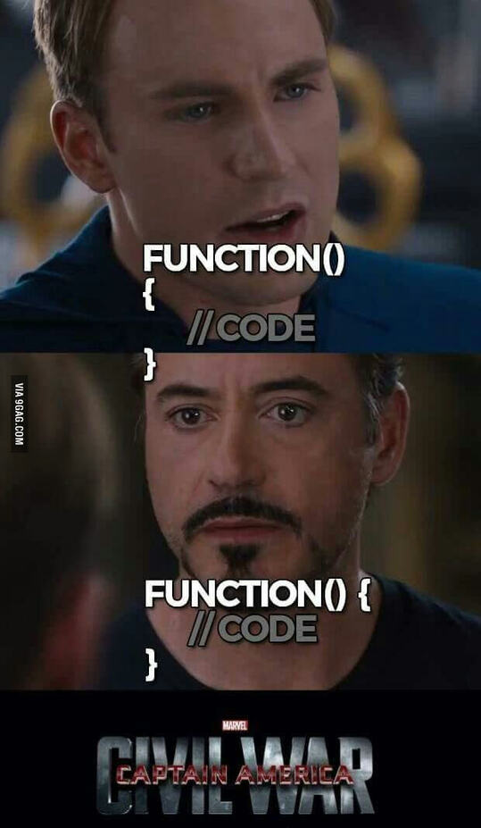

## Introduction
The integration of Artificial Intelligence (AI) into education marks a transformative shift in how knowledge is imparted and skills are acquired, particularly in the field of software engineering. As we delve deeper into the digital age, it becomes almost inevitable—and indeed, somewhat ironic—not to harness the capabilities of advanced technologies such as AI while training the next generation of tech industry professionals. This evolution in educational methodologies is especially pertinent to software engineering, a field inherently intertwined with technological advancement and innovation.
In the course ICS 314, the use of AI tools such as ChatGPT, GitHub Copilot, and others has been a cornerstone approach, reflecting a broader trend of AI's integration into educational settings. These tools not only facilitate a deeper understanding of complex software engineering concepts but also enhance the learning experience by offering interactive, immediate assistance and feedback. ChatGPT, for instance, has served as an invaluable resource throughout the semester, providing explanations, code examples, and debugging assistance, thereby enabling a more engaged and efficient learning process.
This commitment to integrating AI tools like ChatGPT into our curriculum not only prepares students for the immediate challenges of software development but also acclimatizes them to the collaborative interplay between human and artificial intelligences, equipping them with the skills necessary to thrive in a tech-centric world.

## Personal Experience with AI:

1. I did not use ChatGPT as extensively as in other areas of this essay because many of the experience WODs I first tried on my own and always failed miserably. Then, I watched the video and followed along, which I found a lot more insightful. I don't think it's very productive to try something new where you have no idea where to even start or what to type. So, as important as it is to try things on your own to help better understand them, personally, it's a lot more enlightening to watch the WOD videos first, then attempt them on my own so I at least have a quick basic understanding of what needs to be done. Whereas, if I just followed along with the video, typing in as the professor typed, I would also find this not helpful at all as I'm mindlessly following along. So, there definitely is a balance, but in the aspect of ChatGPT, I did not use it very often as ESLint usually caught a lot of errors/format issues and so did the videos. The occasional random bug/typo was sometimes solved by using ChatGPT, but other than that I didn't use it very often for experience WODs.

2. I almost always used ChatGPT in our in-class practice WODs. The content we did in the in-class practice WODs was almost always relevant to the previous night's homework, and, being that memory exponentially falls off as time goes on, unfortunately, I would forget everything by the time. So, I would usually ask ChatGPT certain questions about the prompts, etc. I liked having it build a basic structure for how certain code would work because anytime I would try to have it completely do something, it would not work correctly, and it was easier just to have it give you a basic structure and then, with my knowledge, expand on that. But it definitely helped, and I would not have been able to do many of the in-class WODs without it, as it also can explain code extremely well and why something does what, etc. So, I used it for building code and also explaining code as we got a lot of templates with lines and lines of code where I didn't know what was accessing what, or what was doing what. It was a very powerful tool I used to my advantage during the in-class practice WODs.

3. I occasionally used ChatGPT in the in-class WODs. Once again, it was mainly used as a debugging tool as I don't think it's very accurate in properly creating code for prompts given during our in-class WODs. An example would be during our morning brew WOD, I was a bit confused about where to put what, what to code, etc., so I put the prompt into ChatGPT and it just made me even more confused and actually destroyed whatever code I had and made an unusable, terrible-looking HTML/React/Bootstrap website. I've always found the in-class WODs, practice WODs, and TA WODs to be a lot more enlightening as I can find the actual code examples and use ChatGPT to just explain what each line is doing, rather than creating those lines of code.

4. Another area where I did not use too much AI; the most I would use it for is just to build an outline with ideas I have or to fix my grammar, but other than that, I do everything myself as I think it's very important to have my personality and voice be clear in my essays, whereas ChatGPT can sound very robotic and concrete.

5. I definitely used ChatGPT quite extensively for my final project. I think in this context it was a very appropriate and powerful tool used, especially in the way that I used it, which wasn't really for building or creating any data-based or code, but mainly explaining how many of the data structures, functions, or interactions of the code and then expanding on that on my own, especially in situations where something wasn't working correctly, or if I forgot the syntax for how to create a style update where the marginTop would be at 100px. It was also extremely helpful, even if I wanted to have ChatGPT build everything for me that wouldn't be very beneficial for me in the long run and it also isn't capable of doing that yet like some people may think, and even with the 4.0 version it still gives out a lot of wrong information and unusable code. But for more basic things and explanations, it excels at being that it can answer a very specific question with specific contexts, unlike perhaps a generic but somewhat related question that someone asked 10 years ago online.

6. 100%, if not the most. A lot of the manuals we are given are very load-heavy, and I think the best use of ChatGPT in the context of computer science is getting it to explain very complex concepts. An example of this would be at the beginning of the semester when this would be more relevant as we were deep into JavaScript algorithms/syntax where ChatGPT can amazingly explain complex problems with simpler terms, infinite examples, and you can get instant feedback when you have a question, whereas traditional means of asking a question can take really long where you would have to email a professor or TA, they would have to respond, they might be confused about the context, etc. so ChatGPT is extremely powerful in this context.

7. Anytime I had a question in class or on Discord, the first place I'd go to is ChatGPT. The questions I have were usually easily explained, so it's nice that easily missed code or concepts can be quickly answered, or just even forgetting some sort of syntax as I've delved into many coding languages, it can remind me of those syntax rules format, etc. if ESLint has not already caught that.

8. As I said above, the questions I had were usually answered by ESLint or ChatGPT, and if for some reason I couldn't find my answers, I luckily made some friends in class who were happy to help me and I for them, so I consider myself very grateful for those gracious people that have helped me and was happy to help them as well.

9. Another thing I found useful when using AI was asking for examples of code that used Underscore functions. The Underscore library is vast and was very overwhelming at first, so it is really nice to have additional examples of what each function in this case underscore can do.

10. In my opinion, the most useful and important way to use ChatGPT or any forms of AI is using it to help explain code. This is by far the most useful tool I've ever used in learning how to code and have used it to explain countless lines of code whereas before you would have to google each piece of code line by line that you needed help with and that sometimes wouldn't work and definitely was not efficient as I've definitely had my fair share of looking through forums for hours when AI wasn't a thing, but at the same time, past questions and experiences that can't be answered by AI, the old forums always come back and are still a place of refuge for those of us running into unforeseen errors.

11. ChatGPT writing code is a 50/50 naturally because without certain context/the entirety of the code it can't properly write code, and even if you do give it that information it can still not produce perfect code. But I definitely do think it is good in a way that it gives you a general sense of direction of what you need to do, especially with data structures and algorithms. But anything further than that like writing code in C# for Unity is pretty subpar, as well as a lot of HTML/React/web development you can tell it's not very advanced in that area but definitely gives a good skeleton of what should the code look like, but it won't just make exactly what you want it to.

12. I personally think that ChatGPT is amazing at documenting code, using this along with ESLint is super powerful, and this goes with what I said about it being good at explaining code, this kind of falls in the same realm which is why I think it's such a powerful tool for this context, especially the inline comments it can write are almost always exactly what I need or want, one issue is it can be painfully robotic-sounding but this tone is appropriate for its context.

13. An example of this would be I sent this error with my code above because I was confused about where this fragment was coming from and ChatGPT said, "To resolve the ESLint warning about the unnecessary use of fragments when they contain only one child, you can remove the fragment and directly return the single child element. Here's the modified code without the fragment:" And then it corrected the error that the fragment was causing, so once again ChatGPT in kahoots with ESLint helped me solve a bug that was causing my website to crash. Once again helping me with the intensive process that debugging can be sometimes, especially when hundreds of lines of code are present and you're confused about what might be causing this particular error, a quick solution is almost always the answer and ChatGPT can help with that.

14. Anytime I have a random question, whether it be advice, medical questions, jokes, etc., I always ask ChatGPT for quick precise answers, whereas Google you need to sift through articles and paywalls, ads, etc.

## Impact on Learning and Understanding:

The incorporation of AI into my software engineering education has significantly enhanced my understanding and skill development. Tools like ChatGPT have served as on-demand tutors, adeptly clarifying complex code and breaking down intricate programming concepts into digestible explanations. During my final project, AI was particularly valuable in assisting with styling aspects; it provided quick syntax reminders and guidance on CSS and React, areas where I occasionally forgot details. This immediate, tailored feedback has not only accelerated my learning curve but also improved my problem-solving abilities, enabling me to approach programming challenges with increased confidence and strategic insight. Reflecting on my experiences, it's clear that AI technologies have profoundly enriched my learning experience, making complex software engineering concepts more accessible and less daunting.

## Practical Applications:

## Challenges and Opportunities:

## Comparative Analysis:

## Future Considerations:

## Conclusion:
