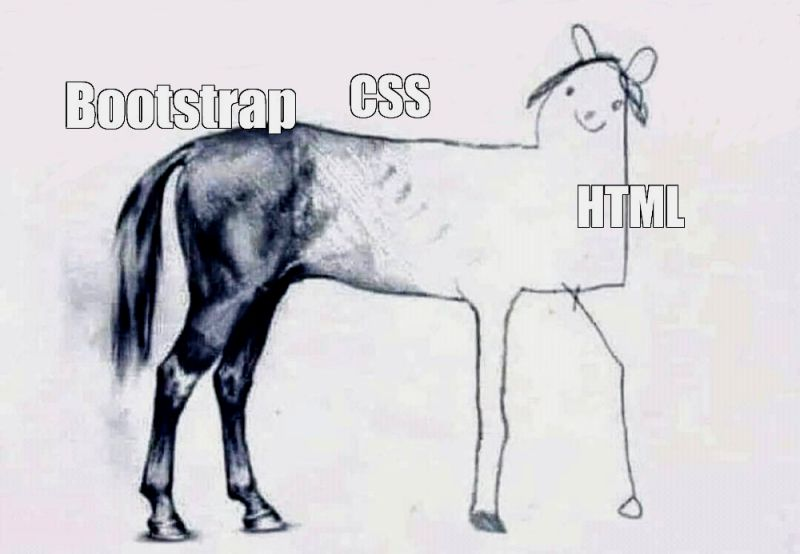

Like any new language in the world of coding, it can seem like rocket science at first. However, as you practice and invest time into that language, the fog surrounding the syntax begins to fade – maybe not as quickly as I would like, but it eventually does. Funnily enough, it only takes about one line of code, and ta-dah, you have an extremely outdated but functioning web page with a single title. So, after extensive practice with HTML and CSS, I can comfortably make a website, which is one of my goals I set when I began my Computer Science career. But, as the dust settled, I was thrown yet another framework, which is always challenging at first. I mentioned in another one of my essays, my journey with JavaScript was difficult but extremely rewarding and remains my favorite language. Then, being thrown a curveball – the introduction to the framework known as Underscore – freaked me out. But once again, I started to realize that these frameworks are made to make our lives as programmers easier, ironically making you start to wish you didn’t know about them because of how seamless and intuitive they are.

## The Comfort of Familiarity

For many coders, our journey into web designs rightfully begins with a good foundation in HTML and CSS. This was my path as well, which stemmed from many hours of coding tutorials that were extremely satisfying, even to a point where it almost felt like a video game as I got to see my website be developed simultaneously from the code I wrote. I sort of feel like I was tricked into enjoying learning HTML and CSS, that trick being the tutorial tasking me with creating a cute waving penguin through almost two hundred lines of code, which I gladly did for hours. Naturally, this gave me a deep sense of comfort and confidence in my ability to understand HTML and CSS code.

## Hold onto your BootStrap

At first, diving into Bootstrap 5 felt like stepping into an unknown realm. The sheer volume of classes and components available was overwhelming, to say the least. An example of this would be how accustomed I was to the manual control that HTML and CSS provided. I could dictate every single margin, color, and font size to my liking. Then having to transition to Bootstrap, which has a grid system and pre-designed components, initially made me uneasy. However, this unease quickly turned into relief as I realized the practicality of Bootstrap. My websites not only started to look significantly more professional and polished, but the development process became faster and more efficient. What previously required meticulous CSS styling could now be achieved with just a few Bootstrap class additions. This realization was liberating because now I could produce better results in less time and, at the same time, intimidating because it challenged my familiarity and comfort with HTML and CSS.

## Conclusion

In conclusion, my journey through the realms of HTML, CSS, and Bootstrap 5 mirrors the evolution many developers experience: from skepticism to reliance. Bootstrap, with its intuitive design and comprehensive documentation, not only made my websites look better but also deepened my understanding of the purpose of UI frameworks. It’s a stark reminder to myself that the landscape of web development is ever-evolving, and that staying open to new tools and frameworks not only enhances our skillset but also the quality of our creations, especially as someone who feels unfulfilled the second I’m not able to learn something new and innovative. As I continue to explore the vast capabilities of Bootstrap, I once again have profound respect for frameworks that make our lives as developers easier, more productive, and our websites more appealing to the world.
