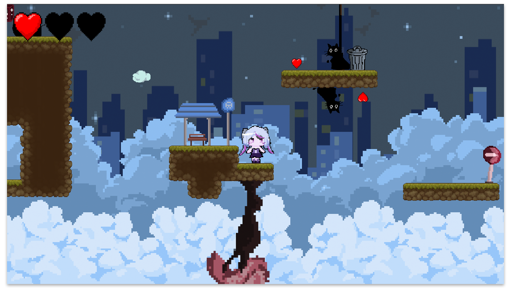

**Project Overview**
In my Intro to Game Design class, I collaborated with two classmates on a month-long project to conceptualize, design, and develop a 2D pixel platformer game, 'Dream Flip'. This project involved creating an engaging game atmosphere and a unique gameplay mechanic that allows players to flip gravity.

**Team Roles**
- **Coding**: I was responsible for the coding aspects of the game, including the implementation of the gravity-flipping mechanic which significantly impacts gameplay dynamics.
- **Level Design**: Another team member focused on conceptualizing the levels, ensuring that each level challenges and entertains players.
- **Art**: The third member of our team handled all the art, creating visuals that perfectly matched the game's intended atmosphere.

**Development Challenges**
Debugging a video game brought its own set of unique challenges, which were considerably different and more complex than any other coding tasks I've tackled. It was not only a technically demanding experience but also extremely rewarding and fun, especially as someone who has grown up with a deep passion for video games.

**Play and Watch**
- Watch our game demo here: [YouTube Demo](https://www.youtube.com/watch?v=bRt4Dj-3v-0&ab_channel=Nobyy)
- Play 'Dream Flip' on our Itch.io page: [Play Dream Flip](https://sephye.itch.io/dream-flip)

**Testing Insights**
During the final playthrough session in our class, where we all had the opportunity to play each other's games, an interesting observation emerged. None of my classmates were able to beat 'Dream Flip', possibly due to its challenging design, which I was more familiar with as the developer. This initially led me to believe that the game might be too difficult. However, when I later shared the game with friends outside of class, they managed to beat it quite easily. This experience underscored the importance of public testing and obtaining feedback from a diverse range of players with varying skill levels. It highlighted how crucial it is to step outside the development bubble to get true insights into a game's accessibility and player experience.

**Sample Code**
Here’s a snippet of the script I wrote for controlling the game's gravity mechanics:

```csharp
public class GravityController : MonoBehaviour
{
    public bool IsGravityUp { get; private set; } = false;
    private Quaternion targetRotation;
    private Transform characterTransform;
    private float gravityFlipCooldown = 1.0f;
    private float lastGravityFlipTime = -2.0f;
    private AudioManager audioManager;
    private PlayerMovement playerMovement;  // Added to access PlayerMovement
    private float groundedBufferTime = 0.5f;  // Time in seconds for the grounded buffer
    private float lastGroundedTime;  // Time when last grounded

    private void Awake()
    {
        audioManager = FindObjectOfType<AudioManager>();
        playerMovement = GetComponent<PlayerMovement>();
    }
    
    private void Start()
    {
        characterTransform = this.transform;
        targetRotation = characterTransform.rotation;
        ResetGravity();
    }

    void Update()
    {
        if (playerMovement.IsGrounded())
        {
            lastGroundedTime = Time.time;  // Update last grounded time
        }

        if (Input.GetKeyDown(KeyCode.F) && Time.time - lastGravityFlipTime >= gravityFlipCooldown && (Time.time - lastGroundedTime <= groundedBufferTime))
        {
            lastGravityFlipTime = Time.time;
            FlipGravity();
        }

        characterTransform.rotation = Quaternion.Slerp(characterTransform.rotation, targetRotation, Time.deltaTime * 5);
    }

    private void FlipGravity()
    {
        IsGravityUp = !IsGravityUp;

        if (IsGravityUp)
        {
            Physics2D.gravity = new Vector2(0, 9.8f);
            targetRotation = Quaternion.Euler(180, 0, 0);
        }
        else
        {
            Physics2D.gravity = new Vector2(0, -9.81f);
            targetRotation = Quaternion.Euler(0, 0, 0);
        }
        audioManager.PlaySFX(audioManager.gravityFlip);
    }

    public void ResetGravity()
    {
        IsGravityUp = false;
        Physics2D.gravity = new Vector2(0, -9.81f);
        targetRotation = Quaternion.Euler(0, 0, 0);
    }
}
```