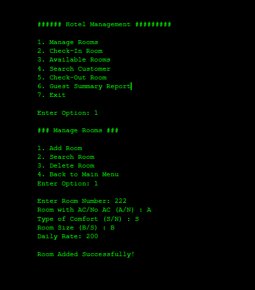
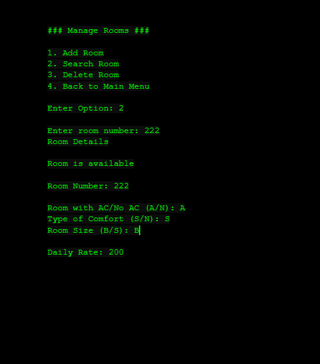
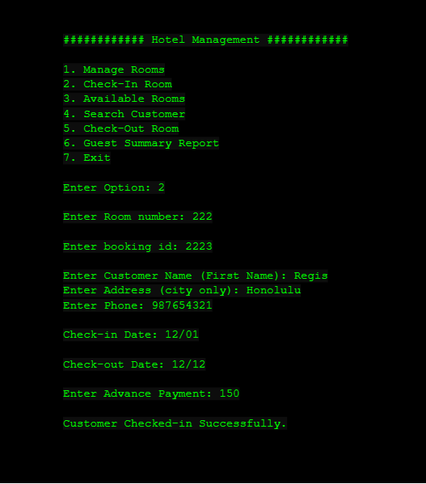

<div class="text-center p-4">
  
  
  
</div>

The ICS 212 (Program Structure) course in Spring 2023 culminated in a challenging yet rewarding group project where we created a Hotel Management System using C++. This project was my first exposure to collaborative software development and significantly advanced my understanding of object-oriented programming.

In our group, my extroverted nature allowed me to naturally step into a leadership role. With a friendly and inclusive approach, I steered our team dynamics to ensure that everyone's ideas were heard and valued. This was pivotal when we encountered a codebase overhaul by one team member. I led a constructive conversation that allowed us to integrate the useful parts of the new code, while maintaining thr original code and boosting our team morale and project integrity.

My primary responsibilities were in the backend development of our system, focusing on the 'Customer' class, the 'Search Room' function, and the 'Check Out Room' function.

Here's a look at the searchRoom class I developed:
```cpp
Room searchRoom(Room rooms[MAX_ROOMS], int amtOfRooms) {
    Room tempRoom; // Temporary Room object to store the search result
    int roomNumber;

    std::cout << "Enter room number: ";
    std::cin >> roomNumber;

    // Iterate through the rooms array to find a room with the given number
    for (int i = 0; i < amtOfRooms; i++) {
        if (roomNumber == rooms[i].getRoomNum()) {
            tempRoom = rooms[i]; // Store the found room
            rooms[i].displayRoom(rooms[i]); // Display the room details
            return tempRoom; // Return the found room and exit the function
        }
    }

    // If the loop completes without finding the room, the room is not found
    std::cout << "Room not found!!!" << std::endl;
    return tempRoom; // tempRoom will be an uninitialized Room object if not found
}
```

Source: <a href="https://github.com/darriusdacquel/InClassFinalProject-ProgramStructure/blob/main/hotel.cpp">InClassFinalProject-ProgramStructure/hotel.cpp</a>

Through this group project, I deepened my technical expertise and solidified my foundational programming skills. I learned the crucial role that clear communication and leadership play in the success of collaborative tech initiatives. The project was a true reflection of my ability to blend technical prowess with social skills to foster a productive team environment and deliver a robust, user-friendly software product.
