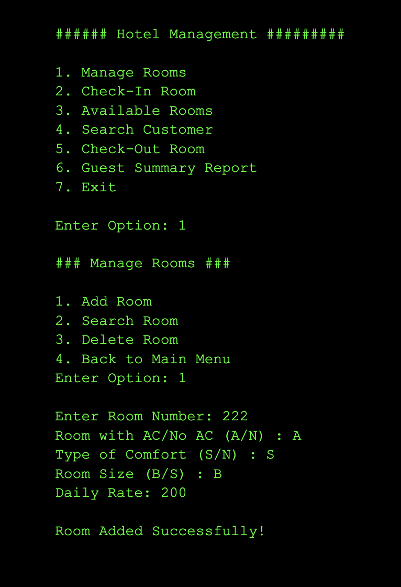

The ICS 212 (Program Structure) course in Spring 2023 culminated in a challenging yet rewarding group project where we created a Hotel Management System using C++. This project was my first exposure to collaborative software development and significantly advanced my understanding of object-oriented programming.

In our group, my extroverted nature allowed me to naturally step into a leadership role. With a friendly and inclusive approach, I steered our team dynamics to ensure that everyone's ideas were heard and valued. This role was pivotal when we encountered a codebase overhaul by one team member. I led a constructive conversation that allowed us to integrate the useful parts of the new code, thus maintaining team morale and project integrity.

My primary responsibilities were in the backend development of our system, focusing on the 'Customer' class, the 'Search Room' function, and the 'Check Out Room' function. My work involved:
Customer Class: Crafting a robust structure to manage customer data with getter and setter methods for encapsulation. Here's a look at part of the class I developed:


 
Source: <a href="https://github.com/darriusdacquel/InClassFinalProject-ProgramStructure/blob/main/hotel.cpp">InClassFinalProject-ProgramStructure/hotel.cpp</a>

Search Room Function: Implementing search functionality that allowed efficient querying of room availability and details. This function was critical for both front-desk operations and room management.
Check Out Room Function: Developing the checkout system that calculates the total amount due, incorporates previous payments, and updates room availability. This function was essential for the accounting and customer service aspects of the system.
Each of these components was developed with a focus on clean, readable, and maintainable code. I also ensured that variable names and function signatures were consistent across our codebase, facilitating easier integration and collaborative work.

Through this group project, I deepened my technical expertise and solidified my foundational programming skills. I learned the crucial role that clear communication and leadership play in the success of collaborative tech initiatives. The project was a true reflection of my ability to blend technical prowess with social skills to foster a productive team environment and deliver a robust, user-friendly software product.
