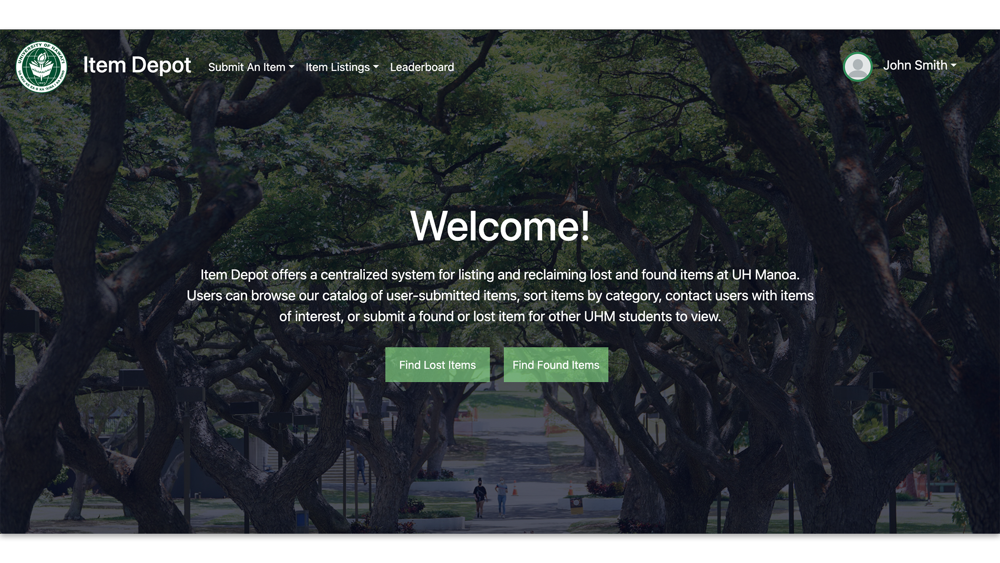

**Project Overview**
As part of my Software Engineering I class, I worked with five other team members to create 'Item Depot', a lost and found management website for UH Manoa. This project involved using agile methodologies, specifically issue-driven management with GitHub, separate branches for features, and merges.

**Team Collaboration and Roles**
Our team adopted a collaborative approach, with each member contributing to various aspects of the project. While I mainly focused on website styling, ensuring the interface was user-friendly and visually appealing, we all supported each other to maintain consistency across the site. This teamwork was essential for keeping everyone aligned with the project goals.

**Technical Challenges and Learning**
Deploying a live website introduced us to the complexities of real-world software deployment. We implemented several features that required comprehensive backend and frontend coordination, including:
- User profiles with customizable profile pictures
- A leaderboard system for active users
- Functionalities for adding, claiming, and managing lost and found items

**Outcome and Reflections**
The project was a success, resulting in a functional and aesthetically pleasing website that has been well received by the campus community. It was a rewarding experience that enhanced our understanding of both the technical and managerial aspects of software development.

**Links and Resources**
- Explore our GitHub repository: [Item Depot GitHub](https://github.com/item-depot)
- Visit the live website: [Item Depot Live](https://itemdepot.org/)
- Check out our homepage: [Item Depot Homepage](https://item-depot.github.io/)
