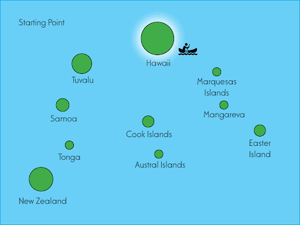

    

Project Overview:
The assignment tasked participants with conceptualizing and describing efficient methodologies for resource sharing and populace mobilization, integrating specific algorithms to optimize these processes under various constraints.

Collaborative Dynamics:
For the first time, I engaged in a collaboration that was entirely conducted online, offering a unique and insightful experience into the nuances of remote teamwork. This project involved synchronizing with peers, whom I only interacted with via digital platforms, emphasizing the significance of clear communication, effective scheduling, and adaptability in a remote work environment.

Individual Contributions:

Darrius Dacquel (Problem #1): Developed a modified Dijkstra's algorithm to optimize the dissemination of knowledge by skilled leaders across the islands. The algorithm incorporated factors such as population density, the recency of visits, and specific skill demands, ensuring that the leaders could impact the maximum number of people efficiently.

Hamza (Problem #3): Focused on the logistical challenge of distributing essential resources like 'uala and kalo across islands, utilizing Prim's Algorithm to establish a priority-based distribution strategy considering the limited availability of canoes and the need for efficient back-and-forth resource transport.

Jennie (Problem #4): Addressed the optimization of tourist experiences across various islands, leveraging Dijkstra's algorithm to map out expedited tourism routes that maximize the variety and quantity of experiences within limited timeframes.

Project Impact:
This project not only contributed to my understanding of algorithmic solutions in a geographically distributed context but also enhanced my competencies in remote collaboration, a skill increasingly vital in today's globalized and digitally connected world. The experience of working remotely, while initially challenging, ultimately proved to be enriching, offering lessons in resilience, communication, and virtual teamwork that are invaluable in the modern professional landscape.
 
Source: <a href="https://docs.google.com/document/d/1b dCteYYMJKE2vIWruI7PH97UcfcMyS3XB_EwtmqUjk/edit](https://docs.google.com/document/d/1b-dCteYYMJKE2vIWruI7PH97UcfcMyS3XB_EwtmqUjk/edit?usp=sharing">Navigation of Islands</a>
