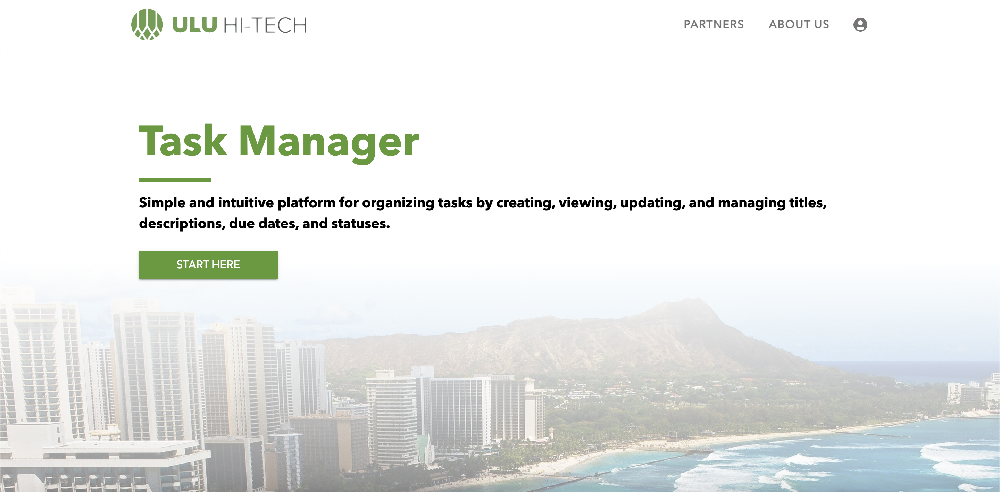
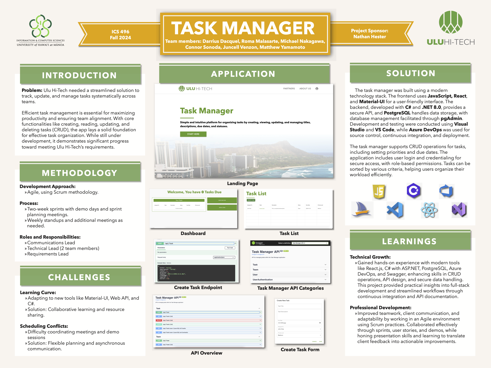

### Strategic Context
Ulu Hi-Tech sought to improve the way it managed tasks across a variety of departments and teams. The goal was to replace fragmented, manual tracking methods with a unified solution that could scale alongside the company’s evolving operations. To address this challenge, our team developed a tailored application that reduces inefficiencies, encourages better collaboration, and provides enhanced visibility into ongoing and upcoming work.

### Technical Approach
The solution is built on a modern web stack designed for performance, security, and adaptability. A React frontend, styled with Material-UI, delivers a clean and intuitive interface for both technical and non-technical users. On the backend, ASP.NET Core Web API ensures a reliable and maintainable server environment, while PostgreSQL provides a stable foundation for persistent data storage. Continuous integration and source control, managed through GitHub and Azure DevOps, support iterative development and maintain code quality throughout the project lifecycle.

### Process and Methodologies
Development followed Agile principles, focusing on two-week sprints that culminated in stakeholder demos and thorough sprint planning sessions. This approach allowed for rapid feedback cycles and incremental improvements, ensuring the product continually met Ulu Hi-Tech’s evolving requirements. Clear role assignments—including leads for communication, requirements, testing, and technology—streamlined responsibilities, enabled prompt decision-making, and supported a collaborative team culture.

### Core Features
- **Comprehensive Task Management:** Users can create, read, update, and delete tasks, ensuring a complete lifecycle from inception to closure.
- **Prioritization and Scheduling:** Tasks can be ranked by priority and assigned due dates, helping teams focus on timely objectives.
- **Secure Authentication:** Role-based credentials and secure login processes ensure that sensitive information remains accessible only to authorized users.
- **Enhanced Visibility:** Dynamic sorting and filtering tools enable quick and targeted insights into workload distribution and progress.
- **Audit Trails:** A tracked history of edits and changes guarantees transparency and accountability, beneficial for compliance and performance reviews.

### Lessons and Professional Growth
The project provided more than just technical insights. Adopting a new stack and integrating unfamiliar frameworks challenged the team to learn quickly, find reliable documentation, and apply best practices. Navigating different schedules and ensuring regular communication highlighted the importance of soft skills—particularly effective collaboration, time management, and stakeholder engagement. Presenting iterative results during demos and incorporating feedback honed our ability to respond constructively to change, a vital skill in dynamic work environments.

### Measured Impact
By centralizing task information and delivering a flexible, user-centric interface, this solution positions Ulu Hi-Tech to operate more efficiently and cohesively. It aligns internal teams around shared priorities and deadlines, reduces administrative overhead, and creates a foundation for long-term scalability. Beyond delivering immediate business value, this project represents a durable, adaptable platform that can evolve to support the company’s future growth and strategic initiatives.
